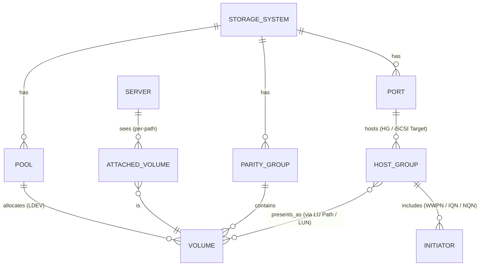

# Hitachi Ops Center: Entity Relationship & API Mapping Guide

This document explains the logical relationships among Ops Center entities — from servers to storage arrays — and how to query each relationship through the **Admin API** and **Configuration Manager REST (CMREST)**.

Use it to quickly understand *what connects to what*, *which endpoints to call*, and *how to traverse a full server-to-LDEV topology.*

---

## 🔍 Core Concept

Ops Center models storage infrastructure as interconnected entities:

* **Servers** consume **LDEVs (Volumes)** presented through **Host Groups** on **Ports** of **Storage Systems (Arrays)**.
* **LDEVs** reside in **Pools** and **Parity Groups** that belong to a **Storage System**.
* **LU Paths (LUNs)** form the many-to-many join between Host Groups and LDEVs.

The diagram below shows both relationships and where to fetch each entity.

---

## 🧭 Relationship Overview



---

## 🧩 API Endpoints by Entity

| Entity                       | Description                         | Admin API                                 | CMREST Search                          | Notes                           |
| ---------------------------- | ----------------------------------- | ----------------------------------------- | -------------------------------------- | ------------------------------- |
| **Storage System**           | Arrays managed by Ops Center        | `/v1/storage-systems`                     | `storageSystem`                        | Parent object for all resources |
| **Pool**                     | Thin or DP pools providing capacity | `/v1/storage-systems/{sid}/pools`         | `pool`                                 | Linked to LDEVs                 |
| **Parity Group**             | RAID-level groupings                | `/v1/storage-systems/{sid}/parity-groups` | `parityGroup`                          | For thick-provisioned LDEVs     |
| **Volume (LDEV)**            | Logical devices / volumes           | `/v1/storage-systems/{sid}/volumes`       | `ldev`, `virtualLdev`                  | Core data entity                |
| **Port**                     | Front-end storage ports             | `/v1/storage-systems/{sid}/storage-ports` | `port`                                 | Interface to host groups        |
| **Host Group (HG / Target)** | Presentation container per port     | `/v1/storage-systems/{sid}/host-groups`   | `hostGroup`                            | 1:1 with port                   |
| **LU Path / LUN**            | Connection between HG and LDEV      | `POST /v1/volume-manager/edit-lun-paths`  | `lun`, `lu-path`                       | Defines presentation            |
| **Initiator**                | Host WWPNs, IQNs, NQNs              | —                                         | `wwn`, `iscsi`, `hostWwn`, `hostIscsi` | Registered initiators           |
| **Server**                   | Discovered hosts                    | `/v1/compute/servers`                     | —                                      | Shows OS and HBAs               |
| **Attached Volume**          | Server-visible paths to LDEVs       | `/v1/compute/servers/attached-volumes`    | —                                      | Joins Server ↔ Volume           |

---

## How to Traverse Relationships

### From a Server

1. **List servers**

   ```bash
   GET /v1/compute/servers
   ```

2. **Get volumes attached to a server**

   ```bash
   GET /v1/compute/servers/attached-volumes/?q=serverId:{serverId}
   ```

   → Returns `storageSystemId`, `volumeId`, `storagePortId`, `hostGroupId`, and `lun`.

3. **Query volumes and host groups**

   ```bash
   GET /v1/storage-systems/{sid}/volumes
   GET /v1/storage-systems/{sid}/host-groups
   GET /v1/storage-systems/{sid}/storage-ports
   ```

4. **(Optional) Deep lookup via CMREST**

   ```bash
   Search: lun, hostGroup, port, wwn, iscsi
   ```

   → Retrieves detailed LU Path and initiator mappings.

---

## CLI Verification (CCI)

From a CCI Command Device host:

```bash
raidcom get port -key detail
raidcom get host_grp -port CL1-A
raidcom get lun -port CL1-A
raidcom get ldev -ldev_id 00:1234
```

Use these to validate the API data directly on the array.

---

## Cardinality Quick View

| Relationship                      | Type | Description                |
| --------------------------------- | ---- | -------------------------- |
| Array → Pool / Port / ParityGroup | 1→N  | Core grouping              |
| Pool / ParityGroup → LDEV         | 1→N  | Capacity source            |
| HostGroup ↔ LDEV                  | N↔N  | Presentation (via LU Path) |
| HostGroup → Initiator             | 1→N  | Registered initiators      |
| Server → Attached Volume          | 1→N  | Paths visible to host      |
| Attached Volume → LDEV            | N→1  | Host–LUN binding           |

---

## Reference Docs

* [Hitachi Ops Center Admin REST API Guide (latest)](https://knowledge.hitachivantara.com/Documents/Management_Software/Ops_Center/API)
* [Hitachi Configuration Manager REST API Reference](https://knowledge.hitachivantara.com/Documents/Management_Software/Ops_Center/Configuration_Manager)
* [Ops Center Common Services Overview](https://knowledge.hitachivantara.com/Documents/Management_Software/Ops_Center/Common_Services)
* [Command Control Interface (CCI) Manual](https://knowledge.hitachivantara.com/Documents/Management_Software/Command_Control_Interface)

---

## Summary

* **Admin API** = high-level operational model (servers ↔ arrays).
* **CMREST** = array-native model (LUNs, host groups, ports, initiators).
* **CCI** = on-array CLI for validation or automation.

Together, they form the full topology chain:

**Server → Attached Volumes → Host Groups → Ports → LDEVs → Pools / Parity Groups → Array.**

## Glossary of Relationship Terms

|                Symbol               | Term                             | Definition                                                                                                                                                                                                        |
| :---------------------------------: | :------------------------------- | :---------------------------------------------------------------------------------------------------------------------------------------------------------------------------------------------------------------- |
|              **1 → 1**              | *One-to-One*                     | Each entity on one side is related to exactly one entity on the other side. Example: a **Port** belongs to exactly one **Storage System**.                                                                        |
|              **1 → N**              | *One-to-Many*                    | One entity can relate to multiple others. Example: a **Storage System** has many **Ports** or **Pools**.                                                                                                          |
|              **N → 1**              | *Many-to-One*                    | The inverse of one-to-many; multiple entities reference a single parent. Example: many **LDEVs** belong to one **Pool**.                                                                                          |
|              **M ↔ N**              | *Many-to-Many*                   | Entities on both sides can have multiple relationships with each other. Example: **Host Groups** and **LDEVs** — each host group can present multiple LDEVs, and each LDEV can be mapped to multiple host groups. |
|      **LU Path / LUN Mapping**      | *Join Relationship*              | A linking construct that realizes the many-to-many relationship between Host Groups and LDEVs. It defines which LDEV is presented to which host group and under what LUN ID.                                      |
|              **Entity**             | *Logical Object Type*            | A distinct class of object in Ops Center, such as a Storage System, Port, Host Group, or LDEV. Each entity type has its own API endpoint.                                                                         |
|           **Cardinality**           | *Relationship Count*             | The number of possible relationships between instances of two entities (e.g., one host group may have many LDEVs).                                                                                                |
|              **CMREST**             | *Configuration Manager REST API* | Low-level, array-native API exposing detailed object relationships (ports, host groups, LUNs, initiators).                                                                                                        |
|            **Admin API**            | *Ops Center Admin REST API*      | High-level API providing an integrated view across servers, volumes, and arrays.                                                                                                                                  |
| **CCI (Command Control Interface)** | *CLI Toolkit*                    | On-array CLI used to query or modify storage objects, often used to verify what APIs report.                                                                                                                      |

---

Would you like me to merge this glossary directly into the full Markdown doc so you have a single cohesive file ready for sharing?

